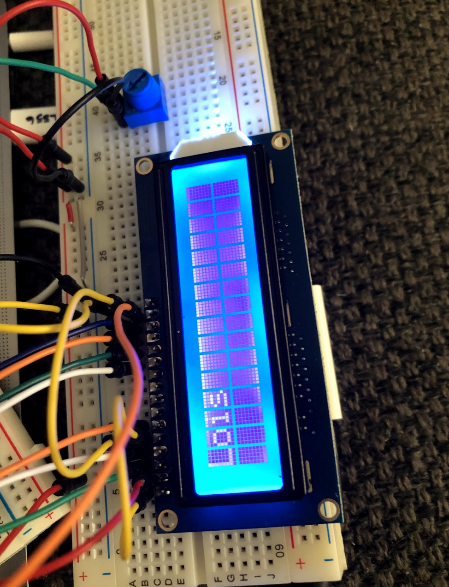
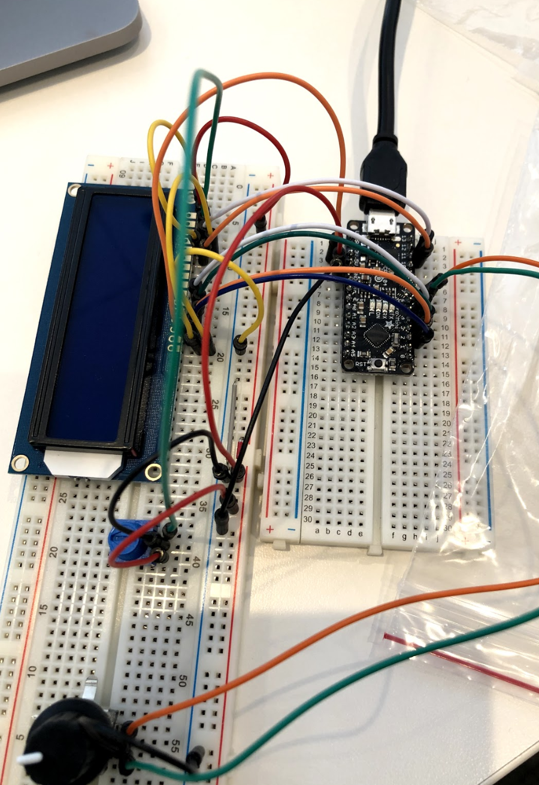

# Digital Timer
 
Include your responses to the bold questions below. Include snippets of code that explain what you did. Deliverables are due next Tuesday. Post your lab reports as README.md pages on your GitHub, and post a link to that on your main class hub page.

## Part A. Solder your LCD panel

## Part B. Writing to the LCD

 
**a. What voltage level do you need to power your display?**

You need both the 5V and 3V voltages for the LCD.

**b. What voltage level do you need to power the display backlight?**

3.3V for the backlight.
   
**c. What was one mistake you made when wiring up the display? How did you fix it?**

I didn't connect the ground and power on both sides of the large breadboard at first so the signal didn't carry.

**d. What line of code do you need to change to make it flash your name instead of "Hello World"?**

`lcd.print("hello, world!"); ` to `lcd.print("Lois"); `
[LCD displaying name](https://drive.google.com/file/d/1UjGtrRICOlj7UK4lj58Ong_veThMRhL4/view?usp=sharing)
 
**e. Include a copy of your Lowly Multimeter code in your lab write-up.**

[LCD displaying changing sensor value from A0](https://drive.google.com/file/d/10nY--HQq6kHgJg0detcRQ1o02ccEcFo4/view?usp=sharing)
[LCD displaying the value from potentiometer for backlight](https://drive.google.com/file/d/1TRVRLEWVAfv1W8L73NVyGgkljWLOVFCA/view?usp=sharing)

## Part C. Using a time-based digital sensor

**Upload a video of your working rotary encoder here.**

[working rotary encoder](https://drive.google.com/file/d/1oizlaBKBPa-WLxRmf7upgwAS2WnnwBhu/view?usp=sharing)

## Part D. Make your Arduino sing!

**a. How would you change the code to make the song play twice as fast?**

Change the noteDuration variable to half of what it is.
 
**b. What song is playing?**
Starwars

## Part E. Make your own timer

**a. Make a short video showing how your timer works, and what happens when time is up!**

